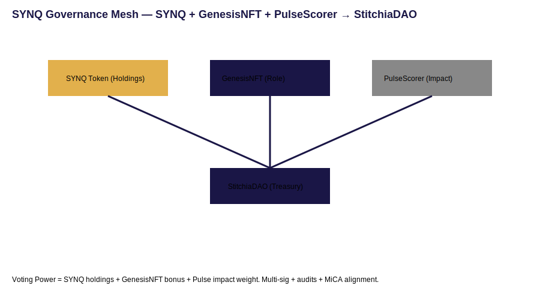
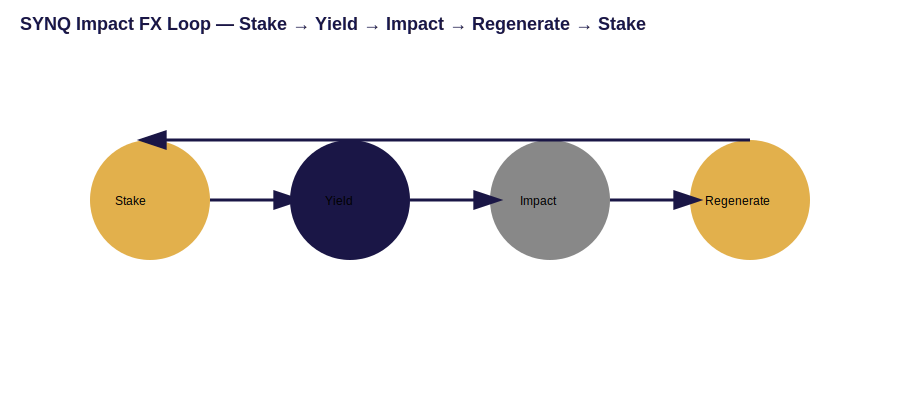

# 1. Executive Summary
**Stitchia** is a digital fabric for regenerative finance — a protocol that synchronizes **governance, economics, and user experience** so capital compounds alongside measurable positive impact. **SYNQ** is the connective token that routes value between these layers.

This v2.7 edition unifies three sources into a single, investor‑ready document:
- Whitepaper v2.6 (architecture, ethics, roadmap)
- SYNQ Tokenomics v3.2 (economic layer, Impact FX)
- Litepaper Draft 0.2 (human‑centered UX, dashboards)

**Thesis:** Align ROI with “Return on Regeneration (RoR)”. Each unit of activity pushes value into verified sustainability pools without sacrificing treasury resilience.

---

# 2. Vision & Principles
- **Regeneration over extraction.** A portion of network value is recycled into on‑chain impact pools.
- **Distributed agency.** Token‑weighted governance enhanced with **PulseScorer** (impact‑based bonus) and **GenesisNFT** roles.
- **Transparent rules.** Open contracts, auditable treasury, explainable metrics, MiCA/ESG‑aware disclosures.
- **Composability.** Open APIs and modular services (registry, analytics, policy).

---

# 3. System Architecture (Overview)
| Layer | Components | Responsibilities |
|---|---|---|
| **Experience** | Next.js dApp, DAO Dashboard (Treasury / Governance / Impact), WalletConnect | Make actions legible; reduce friction |
| **Governance** | `StitchiaDAO.sol`, `PulseScorer.sol`, `GenesisNFT`, Multi‑Sig | Proposals, voting, execution, upgrade gating |
| **Economy** | `SYNQToken.sol`, Staking Vaults, `ImpactRouter.sol`, Liquidity | Yield, routing, treasury stability |
| **Registry & Compliance** | Impact Registry, Audit Trail, Policy Pack (MiCA/ESG) | Transparency, proofs, legal readiness |

> See **Alpha Architecture** for an implementation diagram and MVP scope.  
> `../architecture/Alpha_Architecture.md`

---

# 4. SYNQ Tokenomics (v3.2 Core)
**Supply:** 100,000,000 SYNQ (capped).  
**Recycling (Impact FX):** 0.5–1.0% of value routed to regeneration pools via `ImpactRouter.sol`:
- 30% → DAO Operations Reserve  
- 40% → Green Liquidity Pools  
- 30% → Contributor Yield & Sustainability Fund

**Utility Matrix**
| Utility | Function | Investor Value |
|---|---|---|
| Staking | Lock SYNQ; earn sustainable yield | Predictable, ethics‑weighted APY |
| Treasury Access | Participate in regenerative programs | Aligned capital growth |
| Governance | Propose, vote, upgrade | Exposure to value creation |
| Impact FX | Route % to verified pools | Tangible ESG‑linked yield |

**Distribution & Vesting**
| Category | Allocation | Vesting |
|---|---:|---|
| Founders & Core Team | 20% | 48m vest, 12m cliff |
| Investors | 25% | 24m vest, 6m cliff |
| Community & Ecosystem | 30% | Ongoing DAO programs |
| Treasury & Reserves | 15% | Milestone‑locked |
| Advisors | 10% | 12m vest, 3m cliff |

*Model assumptions and projections are provided in the forecast workbook; see Appendix.*

---

# 5. Governance Architecture
**Voting Power (VP)** is composite:
```
VP = Base(SYNQ) + Bonus(GenesisNFT) + PulseWeight(Impact)
```
- **Base(SYNQ):** token holdings; standard 1:1 weight.
- **Bonus(GenesisNFT):** role‑based multiplier for early stewards.
- **PulseWeight(Impact):** impact‑score‑based boost from **PulseScorer**.

`StitchiaDAO.sol` executes proposals with multi‑sig controls and time‑locks on critical paths. All disbursements are mirrored to the registry for public audit.

> Visual placeholder — Governance Mesh  
> 

---

# 6. DAO Dashboard & UX Layer
**Modules**
- **Treasury Lens:** balances, inflows/outflows, runway, recycling ratios.
- **Governance Panel:** proposals, quorum, delegate map, vote timeline.
- **Impact Scoreboard:** Proof‑of‑Regeneration, pool performance, SDG mapping.
- **Rewards:** staking/LP status, yield projections, claims history.

**User Journey** (wallet → governance → impact → rewards)
1) Connect wallet → balances, score, badges.  
2) Engage governance → weighted voting & proposals.  
3) Stake or LP → pick pools; see APY + impact ranges.  
4) Track outcomes → on‑chain impact proofs; rewards accrue.

> Visual placeholders  
>   
> 

---

# 7. Impact & Regeneration Framework
- **Circular Treasury (30/40/30).** Balances operational resilience, liquidity depth, contributor incentives.
- **Verified Routing.** `ImpactRouter.sol` + attestations; rotate out under‑performing pools.
- **Pulse Metrics.** Individual/project impact influences rewards and VP.
- **Disclosures.** Impact reports minted to registry; dashboards surface headline metrics.

---

# 8. Automation & Deployment
- **Hardhat/Foundry** for compile/test/deploy; CI for lint/tests/gas.
- **CLI** ops: `gov:propose`, `impact:route`, `quantum_registry`, `quantum_export`.
- **Upgrade Safety:** multi‑sig + time‑locks; changelog in `/docs/policy/`.

> Deployment pipeline diagram available in the alpha architecture note.

---

# 9. Ethics & Compliance
- MiCA/ESG‑aware disclosures and on‑chain audit trails.  
- Impact‑weighted governance reduces capture risk.  
- Dynamic yield caps and buffers guard stability.  
- Open proposals, signed rationales, public vote receipts.

---

# 10. Roadmap (Highlights)
- **Q4 2025:** Impact FX routing pilot; dashboards v0; auditor engagement.  
- **Q1 2026:** Governance analytics; public impact registry v1.  
- **Q2 2026:** Cross‑chain liquidity; ecosystem partnerships.  
- **Q3 2026:** Legal opinions across jurisdictions; verification partners.  
- **Q4 2026:** PulseScorer v2 (credit‑like signals); adaptive yield curves.

---

# 11. Appendices & References
- **Technical Appendix:** `../SYNQ_v3.2_DAO_Signature_Edition/Appendices/SYNQ_Tokenomics_Technical_Appendix.md`  
- **Alpha Architecture:** `../architecture/Alpha_Architecture.md`  
- **Forecast Model:** `../SYNQ_v3.2_DAO_Signature_Edition/Models/SYNQ_TreasuryGrowth_Forecast_v3.2.xlsx`  
- **Treasury Flow:** `../SYNQ_v3.2_DAO_Signature_Edition/Visuals/SYNQ_TreasuryFlow_Chart.pdf`

---

© 2025 Stitchia Protocol DAO — *Whitepaper v2.7 (DAO Signature Edition)*
